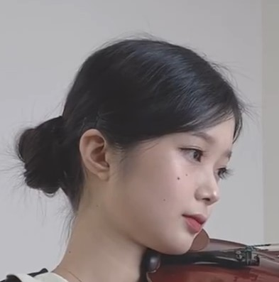

## 想法来源

可以稍稍运行一下meanshift.py，

这里我主要是找了网上一段视频,想对miss.jpg模板进行跟踪，但由于它的原理我查了一下发现没看懂就没深究下去。

还有说一下我以上一帧作为模板的想法来源就来源于这个`meanshift`；

另外的说明：这个想法主要来源于社团晚上去开会时wjx学长拿了篇论文我看到了他们的追踪算法实现，那篇论文是南京理工的，主要是用卡尔曼滤波和`meanshift`来做，而且克服了目标被遮挡矩形框依然可以检测跟踪的情况，这是目前我没能做到的地方（指信标丢失了之后依然可以追踪，听起来有点离谱）,不过还是感谢大佬们的思路！

>  我后面的方案是目标丢失后，自动返回初始的模板，重新在视野范围内寻找目标。
>
> 2022.4.30

