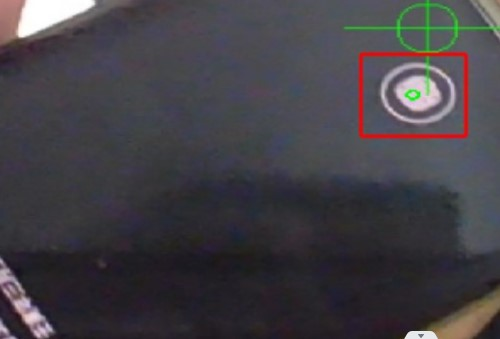
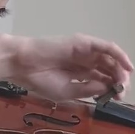
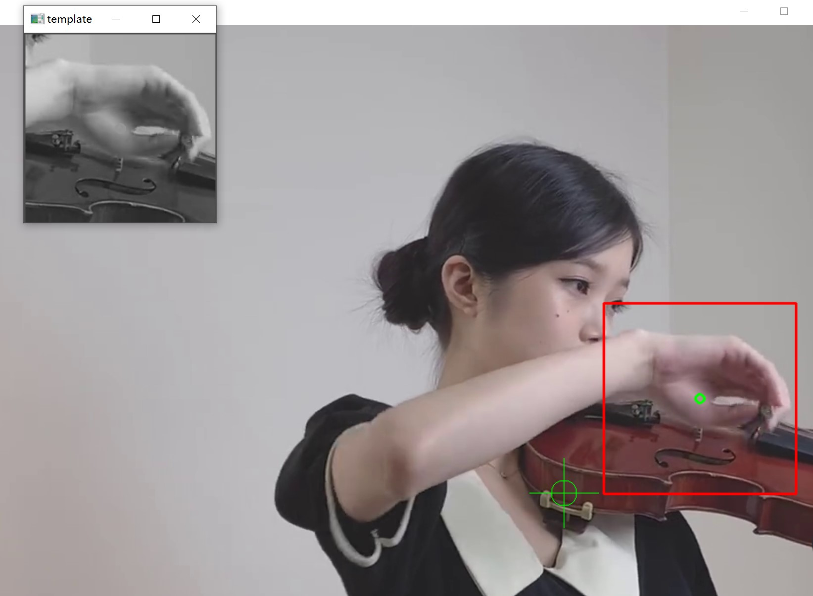
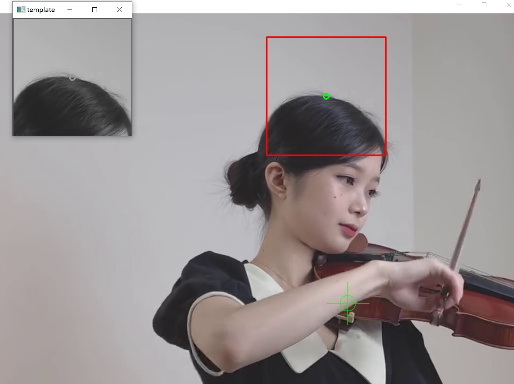

## 模板跟踪实现

这个代码实现了模板调用笔记本摄像头内的跟踪；(其它更多的代码细节我写注释里了)

我觉得可以实时看到它那个模板的变化是非常有意思的，因为当时不方便拿滤光片做实验，而用手机的那个指纹解锁的小圆圈做目标来识别似乎是蛮不错的选择：

这里放上一张样图：

> 如果觉得有意思的话可以把模板名改成`hand.jpg`（这里改：`template0 = cv.imread('true_beacon.png', 0)）`, 而`cap = cv.VideoCapture(0)`改为`cap = cv.VideoCapture('stay.flv')`，会看到有意思的事情(指`result1.jpg`)，这件有意思的事情说明了一个优点，但也暴露了一个缺点；

### 优点：

从这个视频的播放您应该也可以发现这个模板匹配的延迟是非常低的；

### 缺点：

丢失追踪是小问题，但模板变成更新的过程中不小心被“带走”（指由于信标剧烈运动或者形状变化过大而让内部的模板更新成了图片内其它区域相似度较高的位置）到更新成别的模板就不是我们想要的了，这样它就会一直追踪错误的模板（还很稳定），具体被“带走”样例如下，模板为hand.jpg，但是经过一段时间后我们得到了：result2.jpg

但自己后面在基础云台加了滤光片后这种出错几率就会很小很多，也基本不用担心被“带走”的误识别问题；