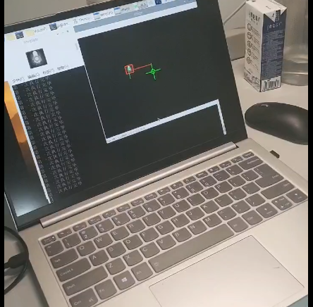
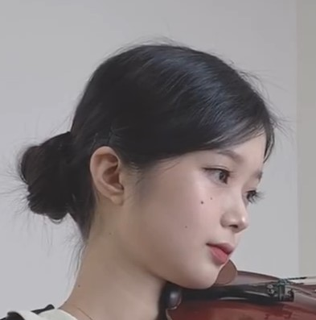
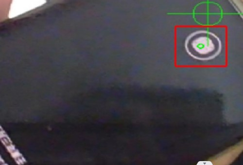
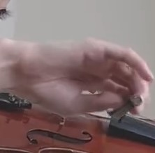
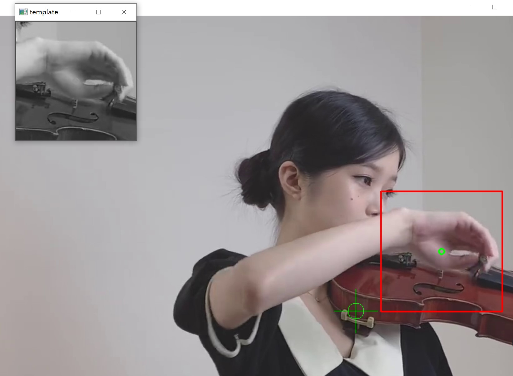
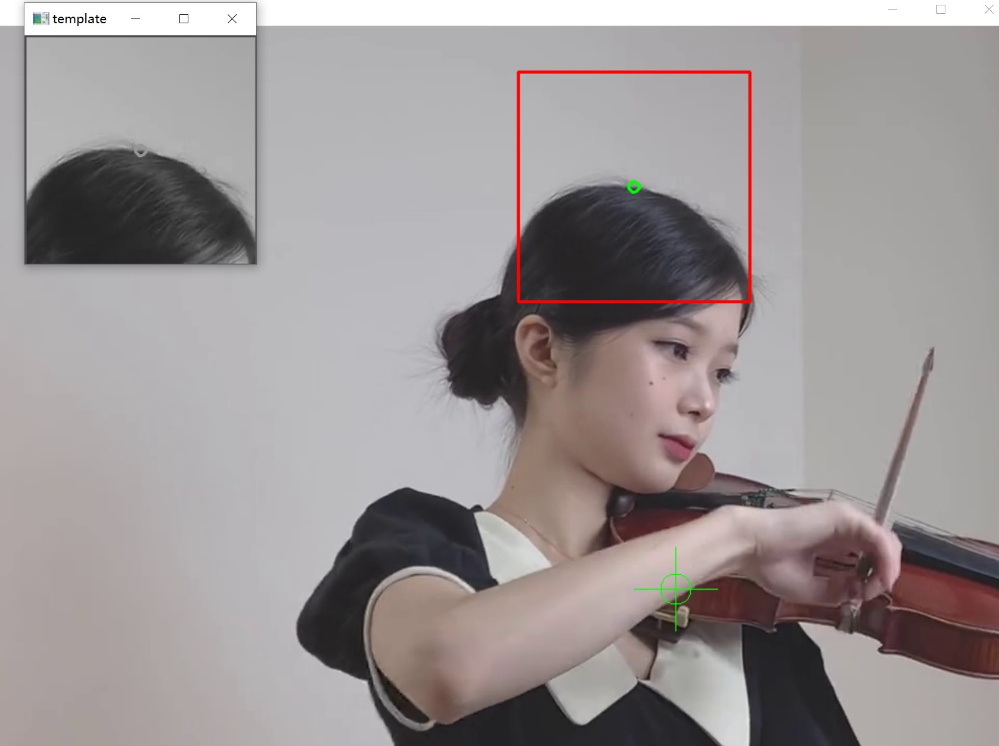

# 基于连续帧的模板匹配实现追踪无人机载信标

>  这四个文件夹是我在五一假期做的东西，最初的目的是为了更好的给学长汇报自己做的工作以及对代码的思考思路；现在学会了一点接近项目尾声了决定把东西整理一下发布出来（刚好自己学了一点点git）

## 最终实现效果

先说一下自己最终实现的结果：

- 完成了基本算法的设计，可以实现稳定确定信标中心的效果；
- 在树莓派4B上实现了控制云台转动[云台：VisionPi (hiwonder.com)](https://www.hiwonder.com/product-detail/VisionPi.html)，但最终没有实现PID的校准，导致追踪的稳定性不够好（如结果展示视频所示，信标位置其实是固定不变的，最终效果就是摄像头绕着摄像头转圈）

 

考虑到直接让学长看几个`py`文件有点乱，（为了把我的真实想法表示出来，也节省大家的时间），我决定整理成几个文件夹，就当是梳理一下我做这个东西的想法，每个文件夹我都做了一定的说明：

- 包括我的想法来源；

- 算法优缺点，进一步的可能方向，都在`README.md`里；

如果可以的话，希望按照这个顺序去看：

- 想法来源：从模板匹配到模板跟踪，即从识别到追踪的想法来源；
- 简单实现：对不同帧率的图片用模板匹配测试一下，看方法是否合适；
- 模板跟踪实现：用不会动的笔记本摄像头看一下效果如何；
- 从图像识别到云台控制：用会动的云台摄像头实际跟踪效果如何；

## 1. 想法来源

可以稍稍运行一下meanshift.py，

这里我主要是找了网上一段视频,想对miss.jpg模板进行跟踪，但由于它的原理我查了一下发现没看懂就没深究下去。

还有说一下我以上一帧作为模板的想法来源就来源于这个`meanshift`；

另外的说明：这个想法主要来源于社团晚上去开会时wjx学长拿了篇论文我看到了他们的追踪算法实现，那篇论文是南京理工的，主要是用卡尔曼滤波和`meanshift`来做，而且克服了目标被遮挡矩形框依然可以检测跟踪的情况，这是目前我没能做到的地方（指信标丢失了之后依然可以追踪，听起来有点离谱）,不过还是感谢大佬们的思路！

>  我后面的方案是目标丢失后，自动返回初始的模板，重新在视野范围内寻找目标。
>
>  2022.4.30

## 简单实现

这个`py`是我修改了之前进行多个目标识别的模板匹配代码，但显然我们的目标只有一个，所以改了一下代码，现在对于所有的样例（指不同帧率下的云台拍摄图片），指在当前文件夹的所有（静态图片）是不会出现误识别的。

## 模板跟踪实现

这个代码实现了模板调用笔记本摄像头内的跟踪；(其它更多的代码细节我写注释里了)

我觉得可以实时看到它那个模板的变化是非常有意思的，因为当时不方便拿滤光片做实验，而用手机的那个指纹解锁的小圆圈做目标来识别似乎是蛮不错的选择：

这里放上一张样图：

> 如果觉得有意思的话可以把模板名改成`hand.jpg`（这里改：`template0 = cv.imread('true_beacon.png', 0)）`, 而`cap = cv.VideoCapture(0)`改为`cap = cv.VideoCapture('stay.flv')`，会看到有意思的事情(指`result1.jpg`)，这件有意思的事情说明了一个优点，但也暴露了一个缺点；

### 优点：

从这个视频的播放您应该也可以发现这个模板匹配的延迟是非常低的；

### 缺点：

丢失追踪是小问题，但模板变成更新的过程中不小心被“带走”（指由于信标剧烈运动或者形状变化过大而让内部的模板更新成了图片内其它区域相似度较高的位置）到更新成别的模板就不是我们想要的了，这样它就会一直追踪错误的模板（还很稳定），具体被“带走”样例如下，模板为hand.jpg，但是经过一段时间后我们得到了：result2.jpg

但自己后面在基础云台加了滤光片后这种出错几率就会很小很多，也基本不用担心被“带走”的误识别问题；

## 从图像识别到云台控制

特别鸣谢李奕贤学长所提供的最初版本的代码，代码是直接从树莓派上拿下来的，经过一些功能的完善（再调用里面原有的库文件），我把它迭代到3.3版本了（根据自己修改的次数来定义的），由于它的库太多了，而且他们总是调用自己代码（代码复用率真的很高），把他的库都放在意义不大，所以我认为只把`pid`这个类放这可能已经足够了（体现了很多面向对象的知识，虽然自己还没有上这门课）；

虽说`pid`调不太对，虽说与后面项目关系不大，但还是感谢这个小小的树莓派，（真的学到很多，感谢！）

:rose::rose::rose::rose::rose::rose::rose::rose::rose::rose::rose::rose::rose::rose::rose::rose::rose::rose::rose::rose::rose::rose::rose::rose::rose::rose::rose::rose::rose::rose::rose::rose::rose::rose::rose::rose:

